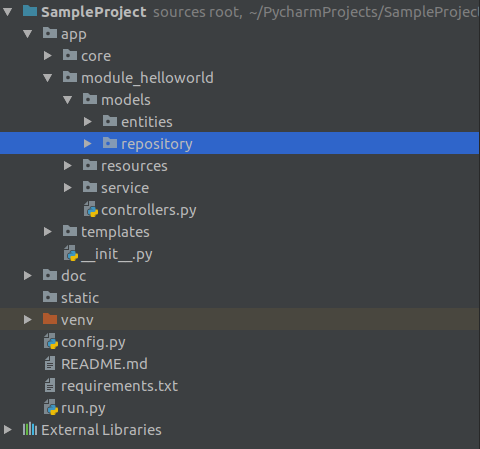

# Project Python web service framework

## Giới thiệu:

Sample web framework để viết API Python sử dụng Flask

## Installation guide:

1. INSTALL PIP:

```sh
sudo apt update & sudo apt install python3-pip
```

2. INSTALL PACKAGES IN requirements.txt

```sh
pip install -r ./requirements.txt
```

## RUNNING WEB SERVICE

```sh
python run.py
```

## Cấu trúc project



## Thành phần chính của project:

| File/Packages name                   	| Description                                                                                     	| Note                                                                       	|
|--------------------------------------	|-------------------------------------------------------------------------------------------------	|----------------------------------------------------------------------------	|
| run.py                               	| File để start development server                                                                	| Setup port, debugging mode                                                 	|
| requirement.txt                      	| File để install các packages cần thiết cho project                                            	| Nếu có thêm lib cần install trong project, chúng ta phải update file này 	|
| config.py                            	| File config Flask                                                                              	|                                                                            	|
| app/                                 	| file application chứa toàn bộ source code                                                        	|                                                                	|
| app/__ init __.py                     | Khởi tạo ứng dụng Flask và tập hợp nhiều components khác nhau                                   	| Khi thêm một file controller mới phải đăng ký blueprint cho controller     	|
| app/core/                            	| Chứa xử lý core của hệ thống (predict model, ...)                                               	| Các phần có thể sử dụng chung trong hệ thống                               	|
| app/templates/                       	| File chứa html của hệ thống                                                                     	| Vì hệ thống publish API nên hiện tại chỉ có file 404.html                  	|
| app/module_helloworld/               	| File module của hệ thống                                                                        	| Chứa controller, service, dto, ...                                         	|
| app/module_helloworld/models/        	| Gồm 2 folder entity và repository <br>entity: object mapping với database <br/>repository: các query database 	|                                                                        |
| app/module_helloworld/resources/     	| chứa resources của module đó (model, file, ...)                                                 	|                                                                            	|
| app/module_helloworld/services/      	| chứa các service của module                                                                     	|                                                                            	|
| app/module_helloworld/controllers.py 	| Routing của module                                                                              	|                                                                            	|

## Phụ lục:

### Virtual environment in Python:
1. [Tại sao cần sử dụng python virtual environment](https://realpython.com/python-virtual-environments-a-primer/)
2. Cách tạo 1 virtual environment:
```sh
#Create virtual env
python3 -m venv [virtual_environment_name]
#Activate virtual env
source [virtual_environment_name]/bin/activate
#Deactivate virtual env
deactivate
```
***Lưu ý***: Khi thêm các packages/lib vào project, nên sử dụng môi trường ảo để việc cài đặt các thư viện optimize nhât  -> hạn chế cài các thư viện k cần thiết 
Script tạo file requirement.txt
```sh
pip install pipreqs
pipreqs /path/to/project
```
Nếu không được có thể sử dụng
```sh
pip freeze > requirements.txt
```
### Flask:
Documentation: [Link](http://flask.pocoo.org/)

### Coding convention:
Documentation: [PEP8](https://www.python.org/dev/peps/pep-0008/#package-and-module-names)

Packages, modules, class name:
> Modules should have short, all-lowercase names. Underscores can be used in the module name if it improves readability.
> Python packages should also have short, all-lowercase names, although the use of underscores is discouraged.

> Class names should normally use the CapWords convention.

Note:
Function, variable name:
> Function names should be lowercase, with words separated by underscores as necessary to improve readability.
> Variable names follow the same convention as function names.

### Demo: